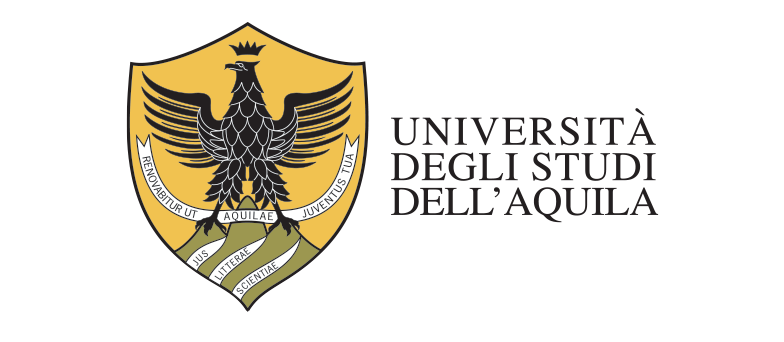

# Agenda

- The regression problem
- Cost function
- Gradient descent
- Regularisation
- Hands-on

# The regression problem

We want a function that maps features to a continuous target.

- Input: $x \in \mathbb{R}^n$
- Output: $y \in \mathbb{R}$
- Model: $\hat{y} = w^\top x + b$

The parameters $w$ and $b$ are learned from data.

# Least squares in one picture



# Cost function

The mean squared error over $m$ examples:

$$J(w, b) = \frac{1}{2m} \sum_{i=1}^{m} \left( \hat{y}^{(i)} - y^{(i)} \right)^2$$

The factor $\tfrac{1}{2}$ simplifies the derivative.

# Comparing the estimators

| Method | Closed form | Scales to large $n$ | Handles collinearity |
|---|---|---|---|
| Normal equation | Yes | No | No |
| Gradient descent | No | Yes | Partly |
| Ridge | Yes | Yes | Yes |

# Implementation

```python
from sklearn.linear_model import LinearRegression

model = LinearRegression()
model.fit(X_train, y_train)
print(model.coef_, model.intercept_)
```

# Two-column layout

::: columns
:::: column
**Underfitting**

- High bias
- Poor on train and test
::::
:::: column
**Overfitting**

- High variance
- Great on train, poor on test
::::
:::

# Summary

- Regression predicts a continuous target
- MSE is the standard cost function
- Gradient descent scales where the normal equation does not
